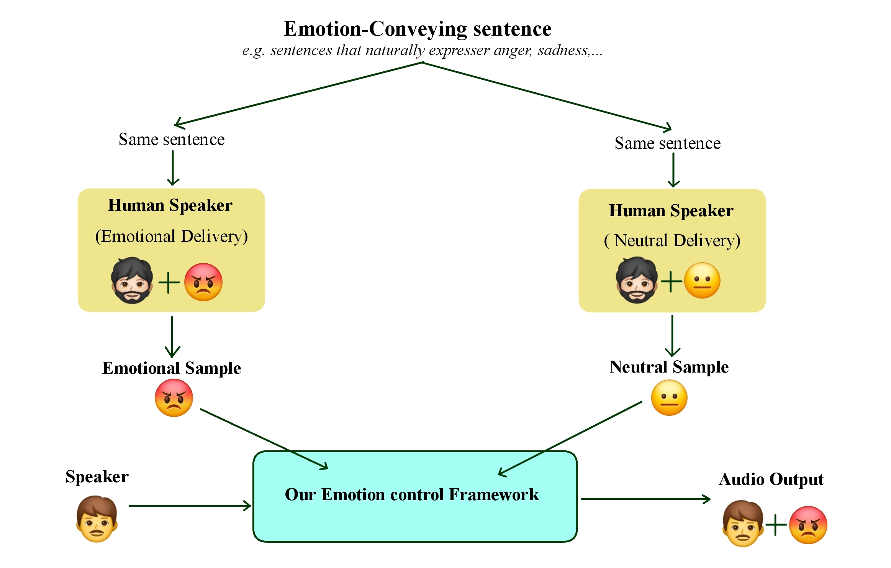
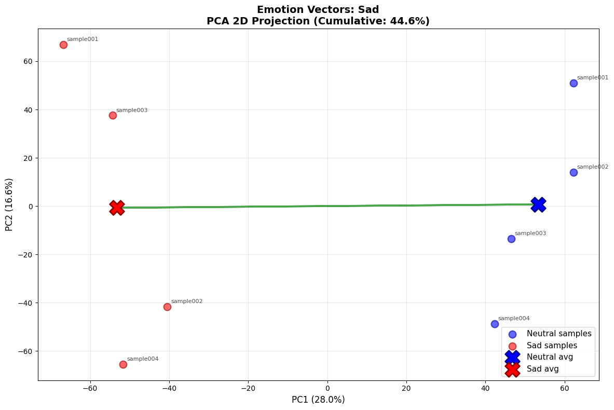
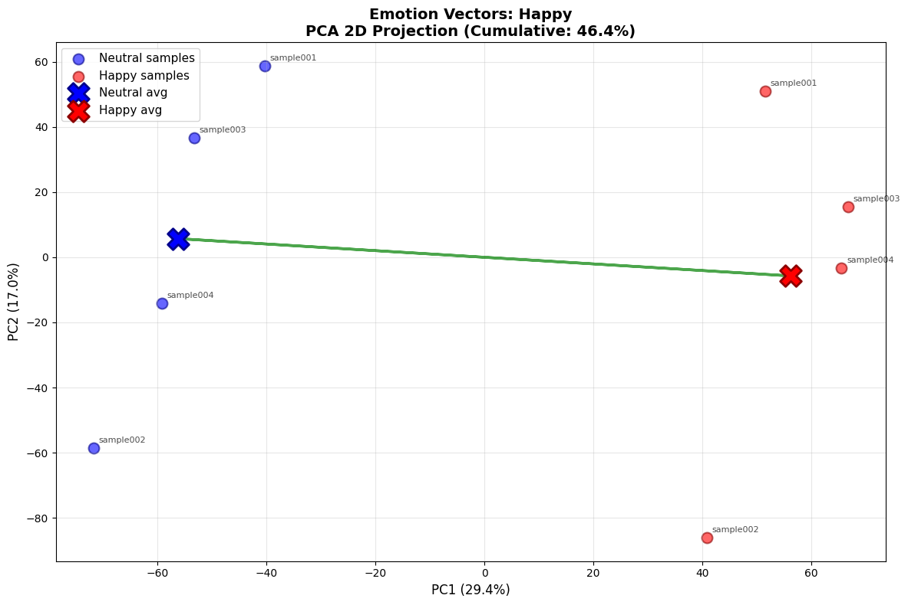
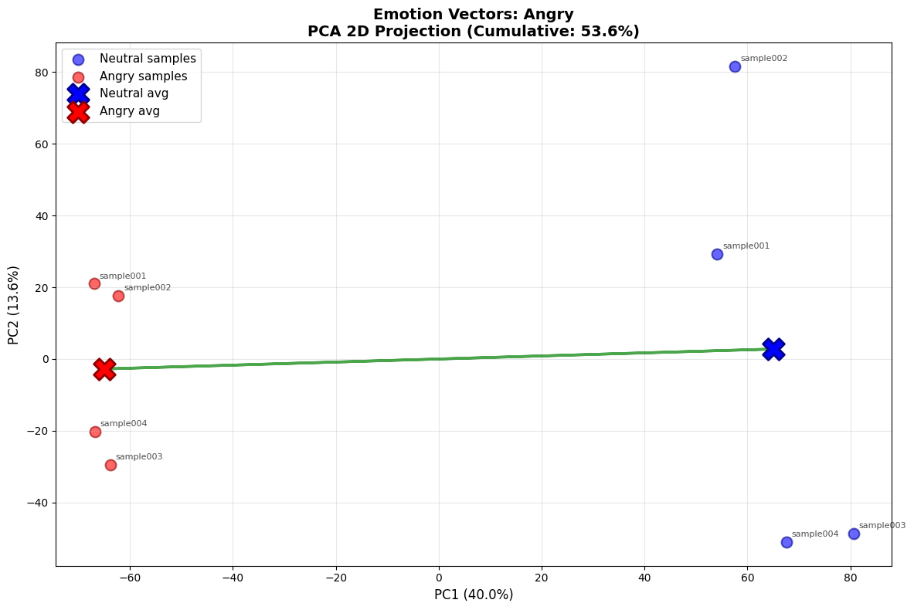
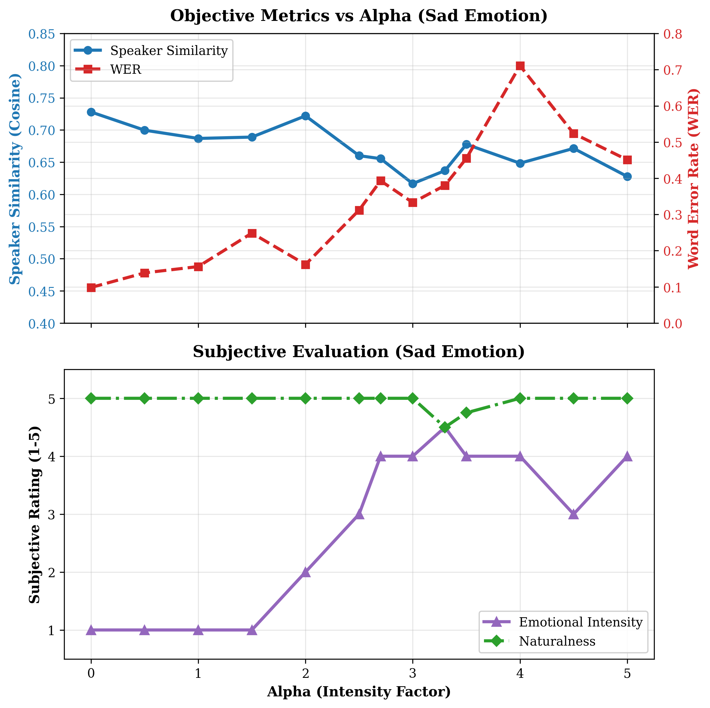
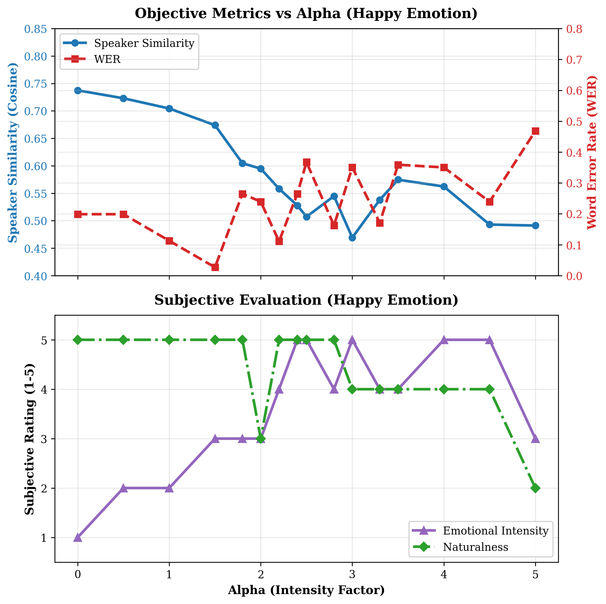
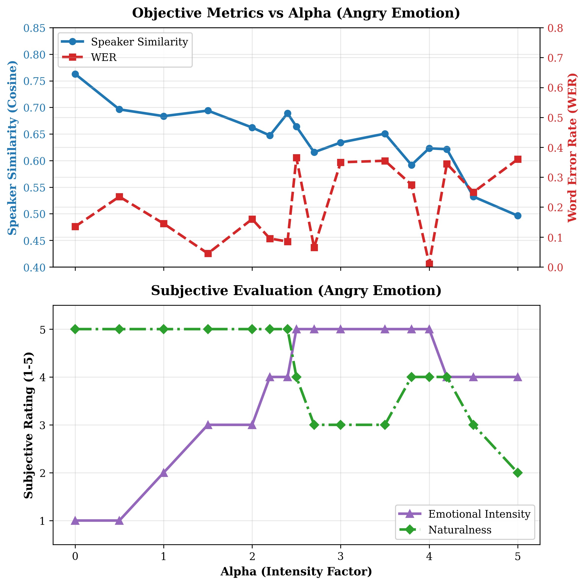

# Hindi Emotion-Controlled TTS with Voice Cloning  
### A Training-Free, One-Shot (and Few-Shot) Emotion Control Framework

## Overview

This project presents a **training-free, inference-time framework** for **explicit and continuous emotion control** in neural Text-to-Speech (TTS) systems, with a focus on **Hindi speech synthesis**.

Unlike conventional emotional TTS approaches that rely on **retraining**, **emotion labels**, or **large expressive datasets**, this framework models **emotion as a direction in latent space** and enables:
- **One-shot** emotion transfer
- **Few-shot** robust emotion control
- **Continuous modulation of emotion intensity**
- **Preservation of speaker identity** relative to the base TTS capability

The method is inspired by *EmoKnob*, but reformulated to operate on **prosody/style-focused conditioning latents** rather than identity-centric speaker embeddings.

---

## Key Contributions

- ✅ **Training-free emotion control** (no fine-tuning or retraining)
- ✅ **One-shot & few-shot emotion transfer**
- ✅ **Continuous emotion strength control** via a scalar factor
- ✅ **Explicit disentanglement of emotion from linguistic content**
- ✅ **Hindi-focused experimentation**
- ✅ **Model-agnostic design** (applicable beyond XTTS)

---

## Core Idea

Modern TTS systems encode speech using multiple latent representations. In **XTTS**, these include:

- **Speaker Embedding** (512-D):  
  Encodes speaker identity and timbre (emotion-invariant by design)

- **GPT Conditioning Latent** (~32,768-D):  
  Encodes **prosody, rhythm, and expressive speaking style**

### Insight

> Emotional expression is primarily embedded in the **prosody/style latent**, not the speaker identity embedding.

Thus, emotion control is achieved by manipulating **only the GPT conditioning latent**, leaving speaker identity intact.

---

## Method Overview

### Paired Data Collection

For each target emotion (e.g., *Sad*, *Angry*, *Happy*):

- Record the **same sentence** twice:
  - Emotional delivery
  - Neutral / monotone delivery

This controls for:
- Speaker identity
- Linguistic content

---

### Emotion / Style Vector Computation

Let:
- $E_{GPT}(·)$ be the GPT conditioning encoder

For a paired sample:
- $z_e = E_{GPT}(x_e)$ (emotional)
- $z_n = E_{GPT}(x_n)$ (neutral)

The emotion direction is computed as:

$$
v_e = (z_e - z_n) / ||z_e - z_n||
$$

---

### One-Shot vs Few-Shot

- **One-shot**:
  - Single emotional–neutral pair
  - Enables precise emotion/style transfer

- **Few-shot**:
  - Multiple pairs averaged for robustness
  - Reduces noise from recording conditions

---

### Emotion Injection at Inference

Given:
- $z_s$ → GPT conditioning latent of target speaker
- $\alpha$ → emotion strength

Modified conditioning latent:

$$
z' = z_s + \alpha \cdot v_e
$$

- $\alpha = 0$ → neutral speech  
- Increasing $\alpha$ → stronger emotional expressiveness

---

## Experimental Findings

### Stability Across Emotions

| Emotion | Stability | Observation |
|------|---------|-------------|
| Sad | ⭐⭐⭐⭐ | Most stable; aligns well with latent manifold |
| Angry | ⭐⭐⭐ | Early saturation; pitch/energy spikes |
| Happy | ⭐⭐ | Least stable at high intensity |

### Trade-offs Observed

- Higher emotion strength → increased expressiveness
- Excessive latent shifts → degraded intelligibility and speaker similarity
- Emotion directions are **not equally aligned** with the decoder’s latent manifold

### PCA Visualization of Emotion Subspaces

### Inference Metrics

---

## Limitations

- Speaker similarity is bounded by the quality of the underlying encoder
- Large emotion strengths ($\alpha$) may:
  - Increase WER
  - Cause decoder instability
- Emotional coverage limited to demonstrated styles

---

## Future Work

- Emotion-specific calibration strategies for $\alpha$
- Cross-speaker emotion representations
- Extension to diffusion-based and non-autoregressive TTS models
- Improved conditioning encoders for better identity preservation

---

## Model-Agnostic Design

This framework assumes only:
- An encoder that maps speech to a conditioning latent
- A decoder that conditions on this latent during synthesis

It does **not** depend on:
- A specific architecture
- Training procedure
- Dataset

Improvements in encoder/decoder quality directly translate to better results.

---

## References

- H. Kim et al., *EmoKnob: Fine-Grained Emotion Control for Text-to-Speech*, arXiv:2410.00316, 2024  
- Coqui AI, *XTTS: A Cross-Lingual, Multi-Speaker Text-to-Speech Model*, 2023–2024  
- Tacotron, WaveNet, and related neural TTS literature

---

## Author

**Arnab Banerjee**  
MSc Big Data Analytics  
RKMVERI, Belur  
Supervisor: Swami Punyeshwarananda

---

## License

This project is released for **academic and research use**.  
Please cite appropriately if used in research or derivative work.

